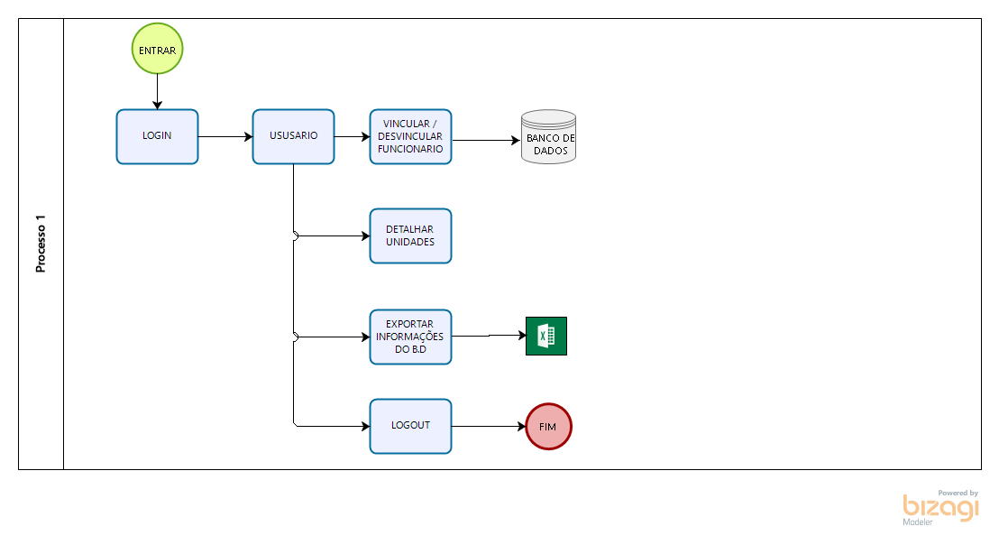
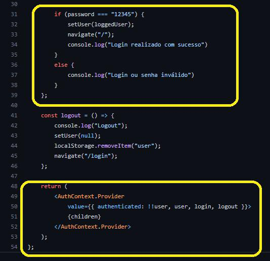

<h5 align="center">
 

    

DEPARTAMENTO DE COMPUTAÇÃO 
SISTEMAS DE INFORMAÇÃO 
 

<!--   -->
 
 

<h4 align="center">
  DOCUMENTO DE REQUISITOS  
  SISGAM • SISTEMA DE GERENCIAMENTO DE ALERTAS DE MANUTENÇÃO  
 </h4>
    

<h5 align="center">
VERSÃO 1.0.0 • JUNHO 2022
   
SÃO LUÍS, MARANHÃO  
</h5>
    

---

<h3 align="center">
  FICHA TÉCNICA  
 </h3>

**Equipe Responsável pela Elaboração**

JAILSON SOARES CANTANHEDE • Database  
IULANO SILVA DOS SANTOS • Server-side  
ODIVAL QUARESMA NETO • Client-side  
  

## Demanda: 
 
Empresas de grande porte que trabalham com manutenção, logística, gerenciamento de estoque, etc, geralmente possuem sistemas de informação que geram alertas para suas equipes, seja para manutenção de equipamentos, seja para informar atualização de estoque, manutenções urgentes e etc.

Nesse contexto, temos o cenário da **EMSERF** *Empresa Maranhense de Serviços Ferroviários*, que já possui um **Sistema Core** que gerencia toda a organização, e este possui um endpoint para gerar alertas de manutenção e atualização de estoque por e-mail, todavia o banco de dados que informa os técnicos que recebem alerta é atualizado manualmente. Isso se deve ao fato da empresa ter feito apenas a aquisição do ***serviço de envio de alertas sem comprar a interface*** (que na ocaisão teria um custo bastante elevado), por conta desse desvio a equipe de operações passou a seguir o seguinte fluxo: 
O setor de manutenção manda um *"Planilhão de Excel"* semanalmente com a relação de técnicos, por conseguinte, também de forma manual, o Administrador de Banco de Dados escreve consultas SQL (INSERT/UPDATE/DELETE) diretamente na base de dados, com os técnicos que, de fato, devem receber os alertas. Isso gera desgaste, sujeição à falha humana e sobretudo impacto direto no SLA das demandas do time de desenvolvimento EMSERF.

Como MVP, temos a proposta do **SISGAM • Sistema de Gerenciamento de Alertas de Manutenção**. Reiteramos que, o SISGAM não substitui o SISCORE, ele é apenas uma **Aplicação Satélite** desenvolvida especialmente para automatizar o processo e reduzir custos de implementação do fabricante do SISCORE.

## Público Alvo:

Este manual destina-se aos gestores e pontos focais da equipe técnica de Manutenção Ferroviária do cliente EMSERF, dando-lhes o conhecimento necessário para operar em uma interface Web capaz de definir, em tempo real, quais profissionais devem receber alertas de manutenção em sua região de atuação.

---
#### Release vs_0.0.1 - São Luís - MA, 16 de Maio de 2022
#### Release vs_0.1.0 - São Luís - MA, 23 de Junho de 2022
#### Versão vs_1.0.0 - São Luís - MA, 27 de Junho de 2022
---

 

**2. DESENVOLVIMENTO  DO  PROJETO**

**2.1 Tecnologia  Envolvida**

Para a diagramação da arquitetura e prototipagem de interface do app, foi utilizaado o Draw.io, Bizagi Modeler, jentamente com o Figma.

No desenvolvimento da interface e da API com a Stack Javascript, utilizaram-se o React JS e o Node Js.

Para o paoio no controle do product backlog e gerenciamento de tascks foi utilizado o Github Projects.

A  ferramenta  utilizada  para  gerenciar  o  banco  de  dados  do  sistema  foi  o  MySQL  WorkBench  8.0, juntamente com o Wampserve para criar um ambiente que falicita a configuração dos software interpretador de scriptes. O diagrama relacional foi desenvolvido no proprio MySQL, atraves da engenharia reversa, mostrando a relação entre os diagramas e suas comunicações.

  

**2.1 Análise  e  Levantamento  de  Requisitos**

O projeto teve início com a elaboração do levantamento de requisitos do sistema, onde foi  possível levantar todas as necessidades e sugestões do cliente. O objetivo principal  esteve focado na criação, em um único ambiente, de um sistema integrado que gerencie a manutenção de equipamentos e atualização de estoque de empresas ferroviarias.

 1. Tela de LOGIN; 
 2. Botões logicos como: Unidades, Exportação de dados, Logout; 
 3. Quadro de unidades
 4. Quadro de tecnicos
 5. Inclusão e Exclusão de Tecnicos
 6. Banco de Dados

Durante o levantamento de requisitos foi identificado que para gerar o detalhamento da unidade seria necessário que os funcionários estivessem cadastrados no sistema, assim identificando quem opera na ferrovia e detalhando o cargo exercido por cada um, sendo assim foram criadas as seguintes funcionalidades:

 - a)	Autenticação de login – A identificação dos diferentes atores que tem acesso ao SISGAM se dá a partir das credencias de login. 
   b)	Unidades IFMA – Detalha todas as unidades vinculadas na aplicação, mostrando o quadro de funcionários, tendo a opção de cadastrar e excluir os mesmos.
   c)	Export Excel – Possibilita que o usuario possa fazer um download no formato CSV, de informações sobre determinados campo ferroviario. 
   d)	Logout – Ação na qual o usuario sai do aplicativo de forma segura.

**2.3	Desenvolvimento do Sistema**

Para o processo de implementação de desenvolvimento do SISGAM, foi necessário que houvesse um planejamento e documentação dos casos de uso dispostos no Documento de Requisitos, para então criar os fluxos de funcionamento do sistema (figura 1). A documentação dos casos de uso serviu para orientar quais recursos deveriam ser elaborados durante o  processo de desenvolvimento do projeto.

**2.4	Atores do Projeto e suas Funcionalidade**
O sistema é baseado somente em um ator, que é o usuario principal. Pois o cliente não ver a necessidade de ter varios atores, pois o gestor vai operar o sistema de acordo com o que o ponto focal pede, que é a visualização do mapa de serviços e a vinculação e desvinculação de um tecnico.

**2.5	Funcionalidades**
**a)	Login**
Funcionalidade que permite acesso ao sistema. Os campos LOGIN e SENHA deverão ser preenchidos de acordo com as credenciais que o usuário recebe. Ao Clicar em ENTRAR, o funcionário terá acesso ao sistema, onde serão disponibilizadas as funções da aplicação.

**b)	Autenticação do Usuário**
O fluxo de Autenticação do SISGAM, à princípio era no formato de assinatura digital com JWT (Json Web Token), todavia conforme realizamos o processo de refinar os requisitos, identificamos que na nossa infraestrutura EMSERF, não precisaríamos deste recurso, uma vez que ao fazer Logon na máquina (S.O), com usuário de rede EMSERF, uma GPO* já roda na sesssão do usuário, dando-lhe privilégios ou não e autenticando sistemas web e desktop. Além do controle de logs para efeito de Auditorias internas.

Por conseguinte, simplificamos o fluxo para a estratégia de autenticação via LocalStorage, onde o utilizando o recurso do próprio navegador é possível realizar a autenticação e mantê-lo na sessão até que efetue logout. Abaixo o componente "Auth.jsx", cuja variável "authenticated" é o termômetro da sessão, dessa forma, componentes que precisam do status da sessão passam a acessá-la em tempo de execução para serem renderizados ou não. Vide abaixo trecho do código de construção do componente "Auth.jsx", responsável pela Autenticação e Gerenciamento de sessão do SISGAM: (figura 2), (figura 3).

<h5 align="center">
 

 Figura X 

</h5>

GPO é uma política de grupo que determina o conjunto de configurações e diretrizes para alterações simultâneas nas operações informatizadas de uma empresa, de forma que as tornem mais práticas e ágeis. Um bom exemplo é uma rede intranet, na qual é preciso gerenciar os acessos e a utilização das funções disponíveis. (figura4)

**c) Tela Principal**

<h5 align="center">
 

 Figura X 

</h5>

**Importante considerarmos que os usuários da EMSERF, utilizam a mesma senha pra logar em qualquer sistema web ou desktop**. Uma vez autenticado na rede corporativa, ou seja, ao seja, **Logon no Sistema Operacional, um script é carregado no servidor tratando privilégios e diretrizes de segurança**.
Sendo assim, **não existe necessidade do sistema ter a funcionalidade "esqueceu sua senha?"**. Além disso como todo bom sistema, há o fluxo de captura de logs, gerado automaticamente para fins de auditoria e **Política Antifraude.**

**d) Detalhamento de Unidade**

Com o login feito, o sistema vai mostrar o menu no canto esquerdo disponibilizando algumas funcionalidades, juntamente com as unidades ferroviarias vinculadas ao aplicativo. (figura 5)
Ao detalhar uma unidade ela mostra os técnicos vinculados a ela, possibilitando a inclusão e exclusão dos mesmos.(figura 6), (figura 7), (figura 8).

<h5 align="center">
 

 Figura X 

</h5>

<h5 align="center">
 

 Figura X 

</h5>

**e) Extração de dados**

Basta clicar  no ultimo icone de extração de dados que a exportação dos dados cadastrais são disponibilizados em arquivos CSV. (figura 9)

<h5 align="center">
 

 Figura X 

</h5>

**3. CONSIDERAÇÕES  FINAIS**

O presente projeto foi possível colocar em prática grande parte do conteúdo teórico  das disciplinas Interação Humano-Computador, Engenharia de Software, Linguagem de  Programação  e  Banco  de  Dados,  bem  como  foi  possível  resolver  parte  do  problema  vivenciado por uma empresa, que depende de uma aplicação para fazer o monitoramento e reparo de seus equipamentos.
